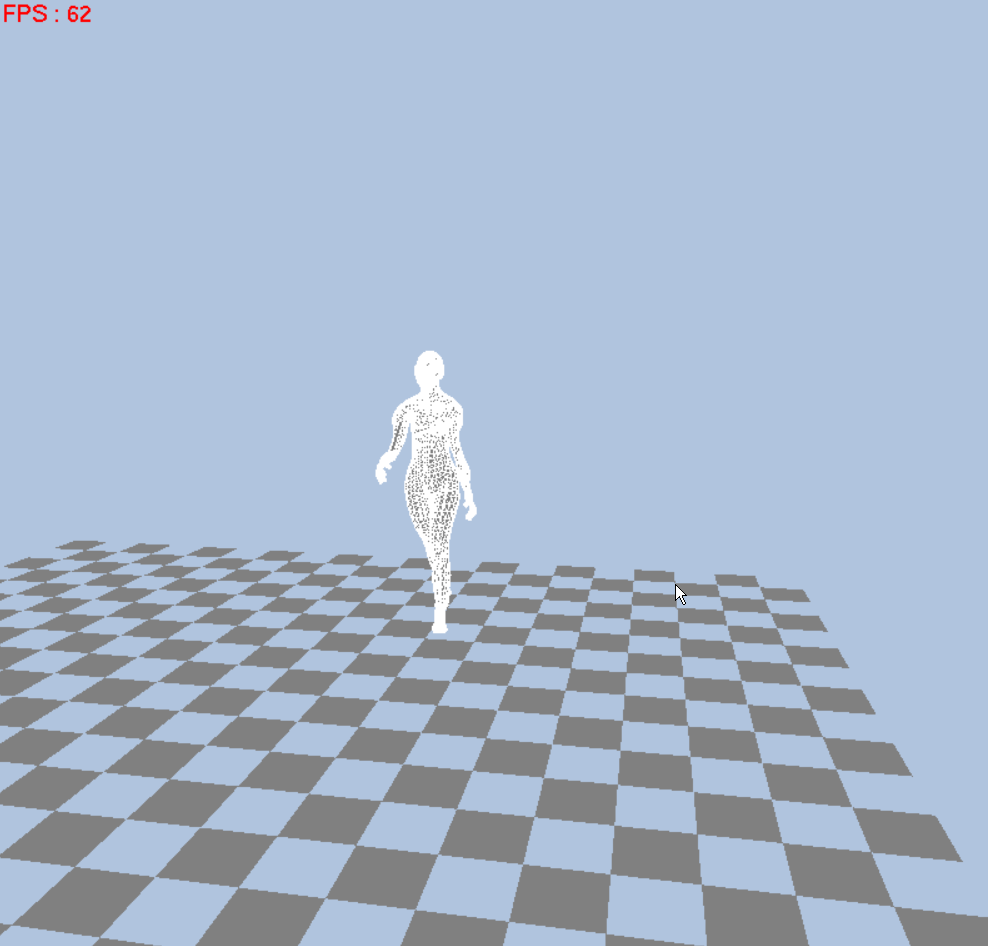

# BVH_Driven_Animation
Human animator driven by {.bvh} files accelerated by CUDA.

Use {.bvh} files from CMU's MOCAP to drive arbitrary 3D model to move!

The skeleton weight map is calculated using the algorithm in 'Bounded Biharmonic Weights for Real-Time Deformation'. You can use this [repo](https://github.com/wkindling/Bounded-Biharmonic-Weights) to get it.

The LBS (Linear Blending Skinning) is accelerated by CUDA. 

Final result:

### Installing 
##### Dependencies
+ Freeglut
+ Eigen
+ CUDA 10.1
